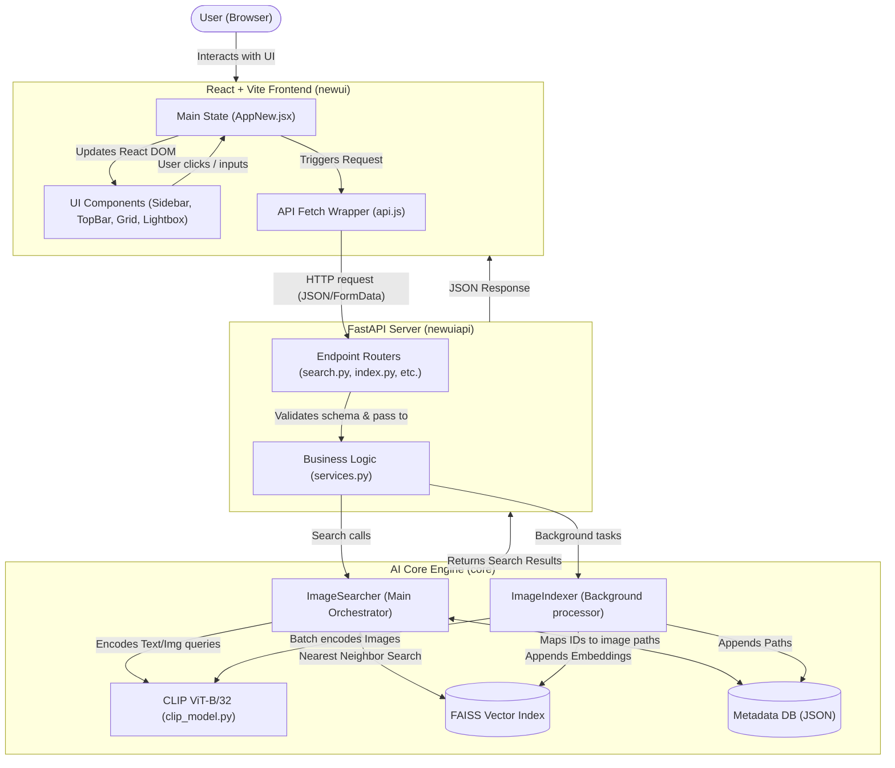
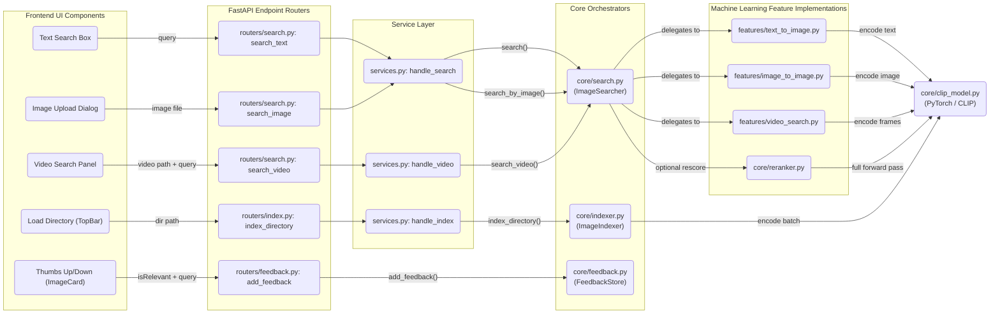

# Semantic Image Search — Architecture & Flow Diagrams

Here are the detailed workflow representations of the application. 

## 1. High-Level Working Diagram
This diagram illustrates how data flows conceptually from the user's interaction in the browser down through the backend and into the AI core, specifically highlighting how representations are passed to the FAISS DB.

---

## 2. File-to-File Feature Routing Graph
This diagram tracks the exact files triggered from the moment a specific feature is activated in the UI until the core executes the response.

