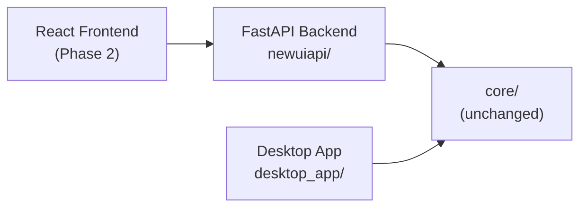

# Walkthrough: FastAPI Backend for Semantic Image Search

## Summary

Created a complete FastAPI backend layer inside `newuiapi/` that exposes all existing `core/` functionality as REST APIs. **Zero files in `core/` or `desktop_app/` were modified.** The existing desktop app continues to work unchanged.

## Architecture



The API is a thin wrapper — all heavy logic (CLIP encoding, FAISS search, reranking, feedback) runs in the existing `core/` module.

## Files Created

```
newuiapi/
├── __init__.py          # sys.path setup for core imports
├── main.py              # FastAPI app, CORS, lifespan, health check, image serving
├── dependencies.py      # Singleton state (CLIPModel, ImageSearcher, ImageIndexer)
├── models.py            # 16 Pydantic request/response schemas
├── services.py          # Bridge layer: API types ↔ core functions
└── routers/
    ├── __init__.py
    ├── search.py        # GET /search/text, POST /search/image, POST /search/video
    ├── index.py         # GET /index/status, POST /index/directory, POST /index/reload
    ├── match.py         # POST /match/image-text
    ├── explain.py       # POST /explain/result
    ├── cluster.py       # POST /cluster/results
    └── feedback.py      # POST /feedback/add, GET /feedback/stats
```

## All Endpoints (14 total)

| Endpoint | Method | Purpose |
|----------|--------|---------|
| `/` | GET | Health check + status |
| `/files/image?path=...` | GET | Serve image files to React frontend |
| `/search/text?query=...&top_k=10` | GET | Text-to-image search |
| `/search/image` | POST | Image-to-image search (file upload) |
| `/search/video` | POST | Video frame search (JSON body) |
| `/index/status` | GET | Index readiness, image count, file size |
| `/index/directory` | POST | Index a directory of images |
| `/index/reload` | POST | Reload FAISS index from disk |
| `/match/image-text` | POST | Image-text similarity score |
| `/explain/result` | POST | Gradient-based visual explanation |
| `/cluster/results` | POST | KMeans + PCA clustering |
| `/feedback/add` | POST | Submit relevance feedback |
| `/feedback/stats` | GET | Feedback statistics |

## How to Run

```bash
cd d:\project\college\imageproject
uvicorn newuiapi.main:app --reload --host 0.0.0.0 --port 8000
```

Then open **http://localhost:8000/docs** for interactive Swagger UI.

## Test Results

All endpoints verified with the live server:

### Health Check
```json
GET /
{
  "status": "ok",
  "service": "Semantic Image Search API",
  "version": "1.0.0",
  "model_loaded": true,
  "index_ready": true,
  "image_count": 6
}
```

### Index Status
```json
GET /index/status
{
  "is_indexed": true,
  "image_count": 6,
  "index_size_bytes": 12333
}
```

### Text Search
```json
GET /search/text?query=sunset&top_k=3
{
  "query": "sunset",
  "results": [
    {"image_path": "...", "filename": "img_5.jpg", "score": 0.212112, "rank": 1},
    {"image_path": "...", "filename": "img_0.jpg", "score": 0.202827, "rank": 2},
    {"image_path": "...", "filename": "img_4.jpg", "score": 0.202036, "rank": 3}
  ],
  "count": 3,
  "took_ms": 364.37
}
```

### Feedback Stats
```json
GET /feedback/stats
{
  "total": 3,
  "relevant": 3,
  "not_relevant": 0
}
```

## Key Design Decisions

| Decision | Rationale |
|----------|-----------|
| **Sync endpoints** | All core operations are CPU-bound (ML inference). FastAPI runs sync `def` handlers in a thread pool automatically — correct for blocking work. |
| **Lifespan for model loading** | CLIP model loads once at startup (~5s) and is shared across all requests. No per-request loading overhead. |
| **Service layer** | Thin `services.py` handles type conversion (bytes→PIL Image, PIL→base64) keeping routers clean and core untouched. |
| **CORS for React dev** | Pre-configured for `localhost:3000` (CRA), `localhost:5173` (Vite), ready for Phase 2. |
| **Image file serving** | `/files/image` endpoint lets React display local images via API, with extension validation for security. |
| **Base64 for frames/heatmaps** | Video frames and explainability heatmaps are encoded as base64 JPEG in JSON responses — no separate file serving needed. |

## Dependencies Added

- `fastapi` (was already installed)
- `uvicorn[standard]` (was already installed)
- `python-multipart` (was already installed)
- `httptools` (installed, for uvicorn standard)
- `watchfiles` (installed, for `--reload` support)

## What's Next (Phase 2)

The API is ready for a React frontend to consume. The frontend would:
1. Hit `/search/text` and `/search/image` for search functionality
2. Display results using `/files/image?path=...` for image URLs
3. Use `/index/directory` to trigger indexing from the UI
4. Use `/feedback/add` for relevance feedback
5. Use `/explain/result` for visual explanations
6. Use `/cluster/results` for scatter plot visualization
